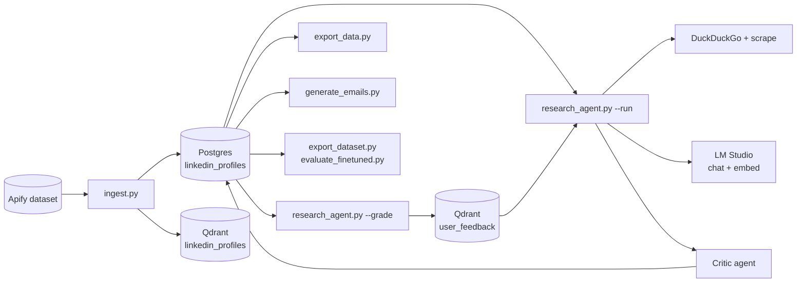

# Auto Marketer

Auto Marketer is a self-improving B2B research and outreach pipeline. It ingests LinkedIn profiles from an Apify dataset, uses a local LLM (via LM Studio) in a ReAct loop to research each prospect, stores analyses in PostgreSQL and embeddings in Qdrant, and closes the loop with human grading that feeds episodic memory, few-shot prompting, a critic agent, and an optional fine-tuning workflow. It is built for a single operator or small team who want a local-first, privacy-preserving alternative to SaaS lead-research tools.

## Key features

- End-to-end pipeline: ingest → research → grade → export → email → fine-tune.
- Multi-agent ReAct loop with DuckDuckGo search and page scraping.
- Critic agent double-checks every analysis before it lands in Postgres.
- Episodic memory: past low-grade feedback is recalled and injected into future prompts.
- Dynamic few-shot examples drawn from the best and worst human-graded analyses.
- Fine-tuning export plus a base-vs-fine-tune evaluator.
- Security hardening: SSRF-safe fetching, prompt-injection fences, CSV formula-injection guards, NUL-byte scrubbing, parameterized SQL enforced by ruff S608 and an AST test.
- Supply-chain hardening via `uv` with hash-pinned `uv.lock` and `pip-audit`.

## Architecture



## Quickstart

Prerequisites: Python 3.10+, [`uv`](https://github.com/astral-sh/uv), Docker Desktop, and [LM Studio](https://lmstudio.ai/) running a chat model and an embedding model.

1. Clone the repo and `cd` into it.
2. Install dependencies: `uv sync --frozen --extra dev`.
3. Start Postgres and Qdrant: `docker compose up -d`.
4. Copy the env template into `.env` and fill in your values (see [docs/getting-started.md](docs/getting-started.md)).
5. Load a chat model and an embedding model in LM Studio and start its local server.

## Usage

```sh
# Ingest profiles from the configured Apify dataset into Postgres + Qdrant.
uv run python ingest.py

# Run the research agent against pending profiles (batch of 5 per invocation).
uv run python research_agent.py --run

# Interactively grade completed research (feeds episodic memory + few-shot).
uv run python research_agent.py --grade

# Export all processed profiles as JSON/CSV/XLSX, full or light mode.
uv run python export_data.py --format xlsx --mode light --output export

# Generate personalized cold emails for SMB prospects and export.
uv run python generate_emails.py --format csv --output targeted_campaign
```

See [docs/README.md](docs/README.md) for the full documentation index, including
[getting started](docs/getting-started.md),
[operations](docs/operations.md),
[data model](docs/data-model.md),
[agents and prompts](docs/agents-and-prompts.md),
[testing](docs/testing.md),
[fine-tuning](docs/fine-tuning.md), and
[architecture](docs/architecture-and-agents.md).

## Security

See [SECURITY.md](SECURITY.md) for the runtime threat model and the supply-chain workflow.

## License

See `LICENSE`.
